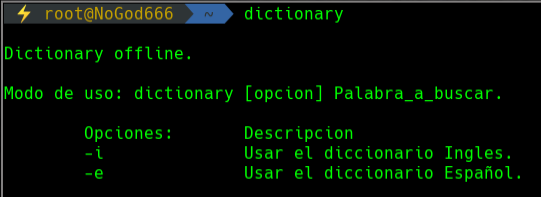
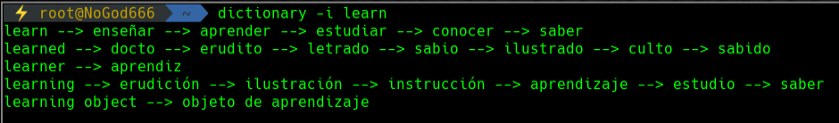
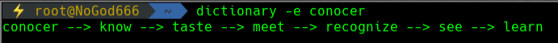

# Diccionario Offline
Un simple diccionario de Ingles y Español practico para usar desde la terminal.
## Uso:

---

---

---

### Tip:
Llamar al script desde cualquier lugar, poner un enlace simbolico en uno de los directorios de la variable $PATH.
```bash
cd /opt/
git clone https://github.com/NoGod666/Dictionary.git
ln -s /opt/Dictionary/dict.sh /usr/bin/dictionary
```
cambiar la linea 16 de dict.sh para evitar errores con el siguiente comando.
```bash
cd /Dictionary/
sed -i 's:./lib/:/opt/Dictionary/lib/:g' dict.sh
```
_Hacer todo como root_
